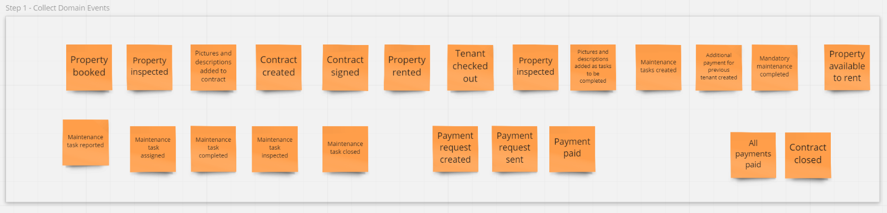
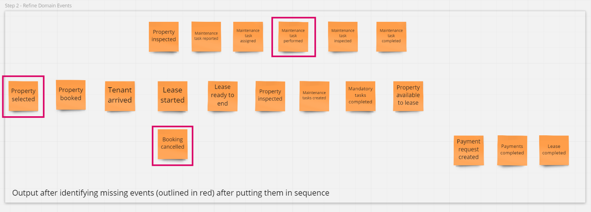
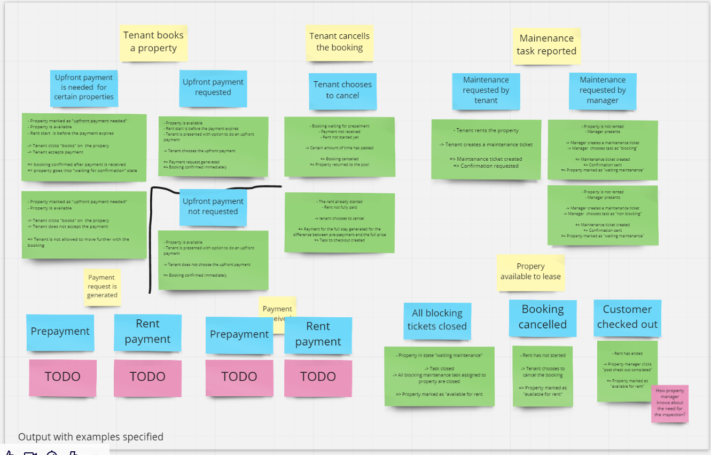
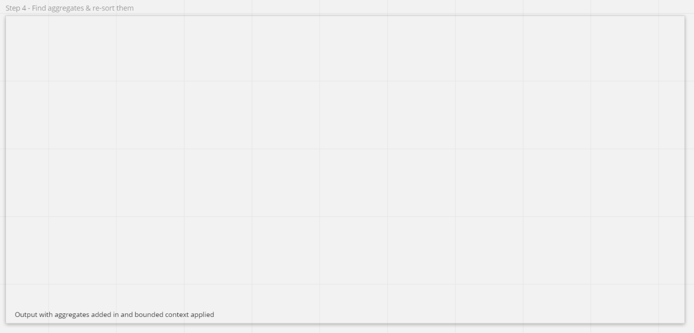

[](https://app.circleci.com/pipelines/github/mpomaran/landlord)
[](https://codecov.io/gh/mpomaran/landlord)

# landlord
DDD showcase project with problem space analysis, system design and various patterns.

<em>This document is ~10% ready, structure will more or less be the same, 
order might be changed, and some chapters will be dropped 
(for example - "solving ambiguity" might not be relevant as it was solved in event storming)</em> 

# Table of contents

1. [About](#about)
2. [Domain description](#domain-description)
3. [General assumptions](#general-assumptions)
4. [System design](#system-design)  
  4.1. [Process discovery](#process-discovery)  
  4.2. [Solving ambiguity](#solving-ambiguity)  
  4.3. [Interfaces with other systems](#interfaces-with-other-systems)  
   &emsp;   4.3.1. [Payment system](#payment-system)  
   &emsp;   4.3.2. [Protocols and their performance](#protocols-and-their-performance)  
  4.4. [Logical design details](#logical-design-details)  
   &emsp;   4.4.1. [Spring](#spring)  
   &emsp;   4.4.2. [Project structure and architecture](#project-structure-and-architecture)  
   &emsp;&emsp;   4.4.2.1. [Aggregates](#aggregates)  
   &emsp;&emsp;   4.4.2.2. [Events](#events)  
   &emsp;&emsp;   4.4.2.3. [Events in Repositories](#events-in-repositories)  
   &emsp;&emsp;   4.4.2.4. [Database](#database)  
   &emsp;&emsp;&emsp;     4.4.2.4.1. [ORM](#orm)  
   4.5. [Physical code design details](#physical-code-design-details)  
   &emsp;   4.5.1. [Architecture-code gap](#architecture-code-gap)    
   &emsp;   4.5.2. [Model-code gap](#model-code-gap)  
   4.6. [Deployment](#deployment)  
   4.7. [Fault tolerance](#fault-tolerance)
5. [Performance](#performance)  
   5.1. [Back of the envelope calculations](#back-of-the-envelope-calculations)  
   5.2. [Scalability](#scalability)  
   5.3. [Monitoring](#monitoring)
6. [Security](#security)  
   6.1. [Measures](#measures)  
   6.2. [Preventing attacks - discussion](#preventing-attacks---discussion)
7. [Ways to improve, next phases](#ways-to-improve-next-phases)    
8. [Tests](#tests)    
   7.1. [BDD](#bdd)  
   7.2. [ArchUnit](#archunit)
9. [How to run](#how-to-run)   
    9.1. [Requirements](#requirements)  
    9.2. [Building the code](#building-the-code)  
    9.3. [Running](#running)  
    9.4. [Collecting metrics](#collecting-metrics)  
10. [References](#references)
     
## About

This project is an example how one can use DDD to design a simple application.

## Domain description

In the business of renting there are a couple of participants:
- landlord (or property manager, operationally manages properties)
- property owner (who might be interested in seeing the big picture)
- tenant
- various people who take care of the property (cleaners, plumbers, etc)

A landlord rents properties to multiple tenants.
Both the landlord and the tenant can report an issue to be fixed. Issues can have different priorities and properties, like pictures before and after or similar.

The landlord needs to keep track of a list of issues to be solved and their status. He needs to keep track of payments. He sends emails or calls if payment is due.

The landlord also needs to keep track of his properties, he needs to be able to store pictures, maps, schematics.

When the landlord rents the property he first creates an agreement with a tenant, documenting the state of the property and generating a contract.
The contract can be modified by adding additional items during the inspection, like a broken cabinet or dented wall.
Contract, together with pictures is signed and stored in the system.
During the stay, the tenant pays the rent according to the contract.
The tenant is able to report issues to be fixed by the landlord. 
After the stay is completed landlord performs an inspection, after which the property is either to be renovated to ready to be rented. The landlord keeps track of the status of each property and offers only available ones.
For each apartment, the landlord is able to see a list of things to fix, as well as aggregate them by priority and types of fixes, to dispatch the TODO lists to his employees.

## General assumptions
## System design  
### Process discovery

Process discovery was performed using the Event Storming technique (with the help of the Miro's [Event Storming](https://miro.com/miroverse/event-storming) template).

The first step of the event storming, collecting domain events is captured here:


After some refinement board looks like this:


The next step was [example mapping](https://cucumber.io/blog/bdd/example-mapping-introduction/). I added this step in order to help me with
defining business scenarios, tests for them and come up with the prioritized task list.

The example mapping did not end with all possible examples as this is only a demo project, and it contains
enough to proceed with the further design. However inte

The result of the mapping is here: 

The example mapping did not end with all possible examples as this is only a demo 
project, and it contains enough to proceed with the further design.

However, the example mapping shed much more light on the domain and makes me think about 
the landlord as a simple glue logic between ticketing system, payment system, 
and the property browser system. This in turn leads to another step of event storming.

<em> Refinement pt 2 goes here </em>

The next step was the detailed process modelling:
- actors
- commands
- read models
- external systems
- time
- automatic domain events

The result of modelling is captured here:


After this step I was ready to answer the following questions:
- What aggregates were discovered?
- Which bounded contexts are discovered?
- Which users trigger which commands?
- Which commands affect which aggregates or external systems and trigger which changes?
- Which aggregates or external systems trigger which events during command processing?
- Which events trigger which policies?
- Which events create which read models for which use cases?
- Which policies call up which new commands?

It leads to the last step of the event storming, software modelling, and the result is:


### Solving ambiguity
<b>Event storming clears out ambiguity</b>

### Interfaces with other systems  
#### Payment system
#### Protocols and their performance  
### Logical design details
#### Spring
#### Project structure and architecture  
##### Aggregates
##### Events
##### Events in Repositories  
##### Database
###### ORM
### Physical code design details
#### Architecture-code gap
#### Model-code gap
### Deployment
### Fault tolerance

## Performance
### Back of the envelope calculations  
### Scalability
### Monitoring

##Security
### Measures
#### Security in third-party modules and legal security
Build pipeline can use JFrog XRay, Amazon Inspector or similar products to detect vulnerabilities and legal risks.

#### Java policies
This measure builds on modular monolith and uses 
```${java.home}/conf/security/java.policy``` 
file to control access to resources for specific packages.

Privileged resources are to be accessed through the ```doPriviledged``` block.

#### Composition and interfaces instead of inheritance
Inheritance might pose a risk in certain cases, like calling overridden method in super in such a way which breaks the super's logic. 
Thus, as a convention, composition and interfaces will be preferred.

#### Signing JAR files
JAR files can be signed to prevent possibility of running the modified code. Java policies should be set in place to allow only signed code to run. 

#### Protecting sensitive data
During the processing objects may hold sensitive data in memory. In case of failure there is a risk they end up in either a core dump
or in a log file, thus following are to be used:
- work on hashed values whenever possible
- free sensitive data for garbage collection as soon as possible
- if possible - overwrite sensitive data with 0's
- do not log sensitive data

Following those rules is not automated and should be checked during the code review.

### Preventing attacks - discussion
#### Byte code attack
This attack is prevented by:
 - signing JAR files
 - using Java policies
 - preventing ```-noverify``` or ```-Xverify:none``` from being used (operationally)

#### Directory structure traversal
This is to be defeated by using ```normalize``` and ```toRealPath```  methods to sanitize paths used. 

#### SQL injection
<b>Decision pending.</b> Using OWASP to apply XML sanitation. Relying on prepared statements or JPA whenever possible.

#### DoS

#### Intercepting sensitive data
#### Unauthorized access
#### Attack network socket
#### Preventing XML injections
Using OWASP to apply XML sanitation.

## Ways to improve, next phases

## Tests    

### BDD  
Tests are written in a BDD manner, expressing stories defined with Example Mapping.
It means I utilize both TDD and Domain Language discovered with Event Storming.

### ArchUnit
The issue with the growing project is to make sure it follows the vision and, especially when it’s written as a monolith. The danger to avoid is a big ball of mud, with a lack of perceivable design. 
There are at least three methods to keep the architecture clean and aligned 
to the design: code review, java modules, and automatic architecture tests. Code review can be easily bypassed or overlooked. Java modules, despite being a great help, cover only one aspect of architecture (dependencies between modules).

Therefore, here I will rely on automatic tests, namely on the [ArchUnit](https://www.archunit.org/), which allows checking more aspects and can provide feedback during the compilation, greatly increasing efficiency.

ArchUnit is a tool that allows you to test the architecture in an easy-to-follow manner. For example, keeping layers (hexagon levels) of abstraction separate can be enforced as follows:

```java 
@ArchTest
public static final ArchRule model_should_not_depend_on_infrastructure =
    noClasses()
        .that()
        .resideInAPackage("..model..")
        .should()
        .dependOnClassesThat()
        .resideInAPackage("..infrastructure..");
```      
and that frameworks do not affect the domain model
```java
@ArchTest
public static final ArchRule model_should_not_depend_on_spring =
    noClasses()
        .that()
        .resideInAPackage("..io.pillopl.library.lending..model..")
        .should()
        .dependOnClassesThat()
        .resideInAPackage("org.springframework..");
```
## How to run

### Requirements
- Java 11
- Gradle

### Building the code
```bash
$ ./gradlew build 
```

### Running

### Collecting metrics

## References

1. [Introducing EventStorming](https://leanpub.com/introducing_eventstorming) by Alberto Brandolini
2. [Domain Modelling Made Functional](https://pragprog.com/book/swdddf/domain-modeling-made-functional) by Scott Wlaschin
3. [Software Architecture for Developers](https://softwarearchitecturefordevelopers.com) by Simon Brown
4. [Clean Architecture](https://www.amazon.com/Clean-Architecture-Craftsmans-Software-Structure/dp/0134494164) by Robert C. Martin
5. [Domain-Driven Design: Tackling Complexity in the Heart of Software](https://www.amazon.com/Domain-Driven-Design-Tackling-Complexity-Software/dp/0321125215) by Eric Evans
6. [A comprehensive Domain-Driven Design example](https://github.com/ddd-by-examples/library)
7. [Java SE Platform Security Architecture](https://docs.oracle.com/en/java/javase/11/security/java-se-platform-security-architecture.html)
8. [Unit Test Your Architecture with ArchUnit](https://blogs.oracle.com/javamagazine/unit-test-your-architecture-with-archunit)
9. [Example